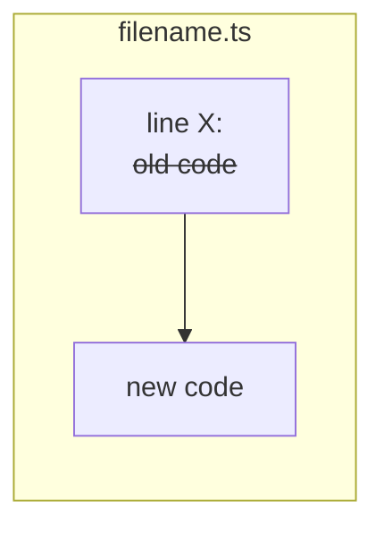
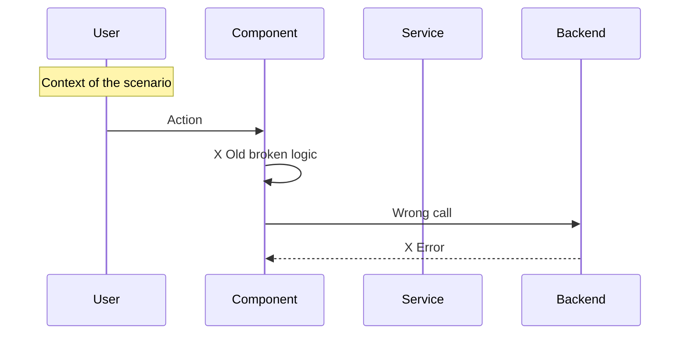
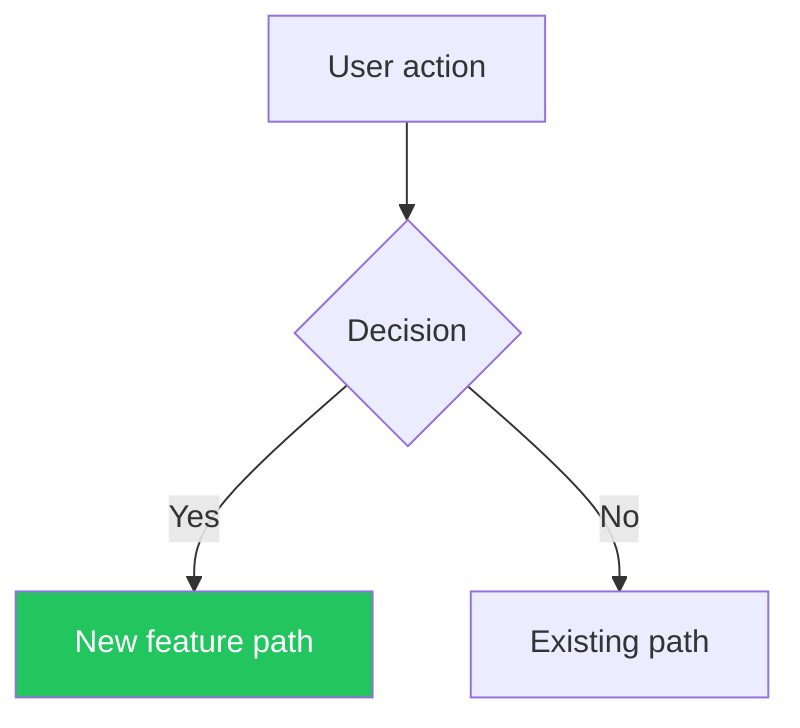
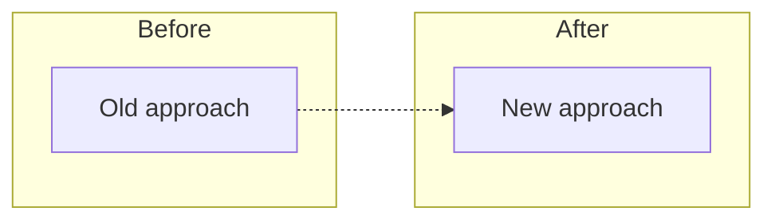
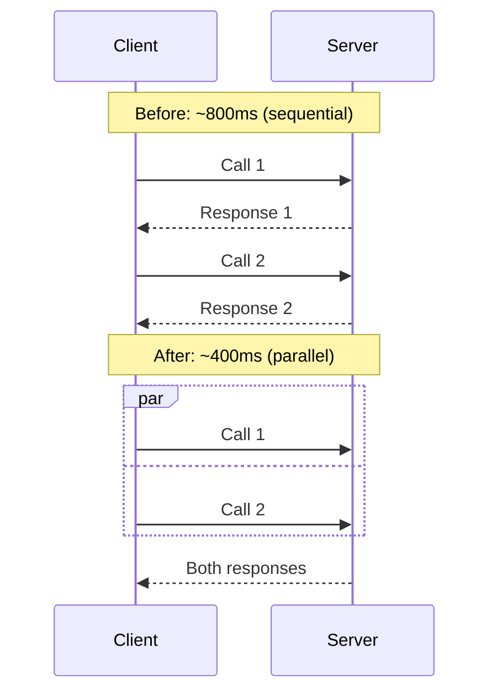
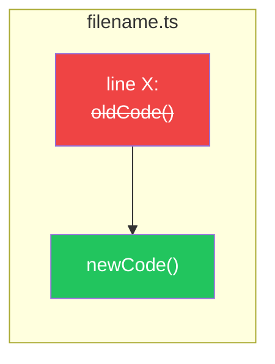

# PR Description Generator

Generate a comprehensive, visual description following the format below. Reviewer understands entire PR in under 60 seconds by scanning diagrams and bold titles.

## Process

1. **Identify the base branch** (usually `master` or `main`)
2. **Read ALL commits** in the branch: `git log --oneline <base>..HEAD`
3. **Read the full diff** against base: `git diff <base>...HEAD --stat` for an overview
4. **Read the actual code changes** for key files: `git diff <base>...HEAD -- <file>` to understand the logic
5. **Categorize changes** into: Features, Bug Fixes, Performance, UI/UX, Refactoring, Testing, Documentation
6. **Create Mermaid diagrams if applicable** (see Diagram Guidelines below)
7. **Write the description in English** regardless of the conversation language

## PR Description Template

````markdown
## Summary

[1-3 bullet points explaining WHAT changed and WHY, in plain language]

## Diagrams

Only required for architectural or system changes. 

### [Diagram title - e.g., "Data Flow", "Bug -> Fix", "Architecture Change"]

```mermaid
[Appropriate diagram type - see Diagram Guidelines]
```

### [Additional diagram if needed - e.g., "Code Changes", "State Machine"]

```mermaid
[Additional diagram]
```

## Changes

### [Category 1] (e.g., Features, Bug Fixes, Performance)
- **[Change title]** - brief explanation of what and why
- **[Change title]** - brief explanation of what and why

### [Category 2]
- ...

## Code Changes (key files)



## Test Plan

- [x] [Automated test that passes - with count if applicable]
- [x] [Another automated test]
- [ ] [Manual test step to verify]
- [ ] [Another manual verification]

### What type of PR is this?

- [ ] Refactor
- [ ] Feature
- [ ] Bug Fix
- [ ] Optimization
- [ ] Documentation Update
- [ ] Testing Coverage
- [ ] Other

## Evidence (Before/After)

<!-- Backend / API / service — run locally, exercise with real requests, capture stdout/responses, render to PNG: -->


<!-- UI — run the app locally, drive the real screen with Playwright, screenshot actual rendered UI: -->
| Before | After |
|--------|-------|
|  |  |

<!-- New component — no prior screen exists, after-only: -->


<!-- CLI / hooks / scripts — run the real command, capture real output, screenshot it: -->


<!-- Fallback only when the service genuinely cannot be run locally (hard external deps, secrets): capture from a real deployed run or emit an explicit placeholder for the author — NEVER invent or mock the image: -->
| Before | After |
|--------|-------|
| _[author: attach REAL BEFORE screenshot here — no mocks]_ | _[author: attach REAL AFTER screenshot here — no mocks]_ |
````

## Evidence Contract

Evidence MUST be a real embedded image `` derived from genuine run of real system. Fabricated/illustrated/mocked output = defect. Upload PNG as draft-release asset named `pr-{N}-evidence.png` on persistent `pr-evidence` draft release, then embed.

**Capture tools**: use Playwright (drive real UI, screenshot rendered page) or `agent-browser` (agent-driven browser capture). For CLI/scripts: run real command, capture stdout to file, render to PNG. For backend: capture real HTTP responses/logs, render verbatim to PNG.

### Embed

Post the image as a PR comment and/or include it in the description:

```
gh pr comment {N} --repo {owner}/{repo} --body ""
```

## Diagram Guidelines

### For Bug Fixes -> Sequence Diagram (Before/After)

Show the broken flow AND the fixed flow side by side:



Then a second diagram showing the fix with checkmark markers.

### For Features -> Flowchart or Sequence Diagram

Show the new data flow or user journey:



### For Refactoring -> Flowchart with Before/After subgraphs



### For Performance -> Sequence Diagram with timing



### For Code Changes -> Flowchart with strikethrough

Show the key code changes visually:



## Color Conventions for Diagrams

Use consistent colors across all diagrams:

- `#22c55e` (green) -> Correct/Fixed/New/Success
- `#ef4444` (red) -> Broken/Removed/Error
- `#f59e0b` (amber) -> Warning/Fallback/Changed
- `#3b82f6` (blue) -> Info/Alternative path
- `#6366f1` (indigo) -> Default/Neutral state

## Rules

1. **Language**: Always write in English regardless of conversation language
2. **Diagrams are optional**: Include for architectural or system changes (see Diagram Guidelines)
3. **Be specific**: Don't say "various improvements" - list each change
4. **Group logically**: Group related changes under clear category headers
5. **Lead with impact**: Start each bullet with **bold title** describing the user/developer impact
6. **Keep it scannable**: Reviewers should understand the PR in 30 seconds by reading bold titles and diagrams only
7. **Test plan with checkboxes**: Always include a test plan with `[x]` for automated and `[ ]` for manual tests
8. **Include test counts**: If tests exist, show counts (e.g., "115/115 tests pass")
9. **Don't include formatting-only changes**: Skip whitespace/quote reformatting
10. **Check the PR type boxes**: Mark the appropriate checkboxes
11. **Remove template boilerplate**: Delete any default PR template instructions
12. **Link Linear issues**: If there are associated Linear issues, link them at the bottom
13. **Evidence is always a real-run embedded image**: Evidence MUST be real embedded image `` derived from genuine captured output (see Evidence Contract). Fabricated/illustrated/mocked = defect. Only fallback: explicit author-screenshot placeholder that resolves to embedded image once filled with REAL screenshot.

## Mermaid Syntax — GitHub Compatibility

GitHub's Mermaid renderer is strict. Follow these rules to avoid parse errors:

1. **Subgraph IDs must not start with or be bare numbers.** Use `subgraph MyId["Label 012"]` instead of `subgraph Label 012`
2. **Node IDs must be alphanumeric identifiers** (no spaces, no leading digits). Put display text in `["..."]`
3. **Avoid special characters in bare labels**: parentheses, colons, pipes, ampersands, and quotes must be inside `["..."]`
4. **Link labels** use `-->|"label text"| B` — quote the label if it contains spaces or special chars
5. **Keep diagrams simple**: max ~15 nodes per diagram. Split into multiple diagrams if needed
6. **Always test mentally**: if an ID or label contains numbers, spaces, or symbols, wrap it in `["..."]`

### Common mistakes → fixes

| Broken | Fixed |
|--------|-------|
| `subgraph Migration 012` | `subgraph Mig012["Migration 012"]` |
| `A -->\|schema\| Migration 012` | `A -.->\|schema\| Mig012` |
| `Node (optional)` | `Node["Node (optional)"]` |
| `DB: PostgreSQL` | `DB["DB: PostgreSQL"]` |

## Anti-patterns

- Don't present pasted terminal output, logs, or a test run (even red → green) as evidence — evidence is an image of the real thing working, embedded as ``.
- Don't fabricate, illustrate, or mock the evidence image — content must be copied verbatim from actual captured output.
- Don't use branch-based raw.githubusercontent.com URLs for evidence — use draft-release asset URLs via `gh release upload`.
- Don't auto-checkout the base branch to capture UI before-state — drive the real app locally with Playwright for before/after screenshots.
- Don't skip the real run because the service "seems simple" — even a trivial handler must be exercised for real before claiming it works.
