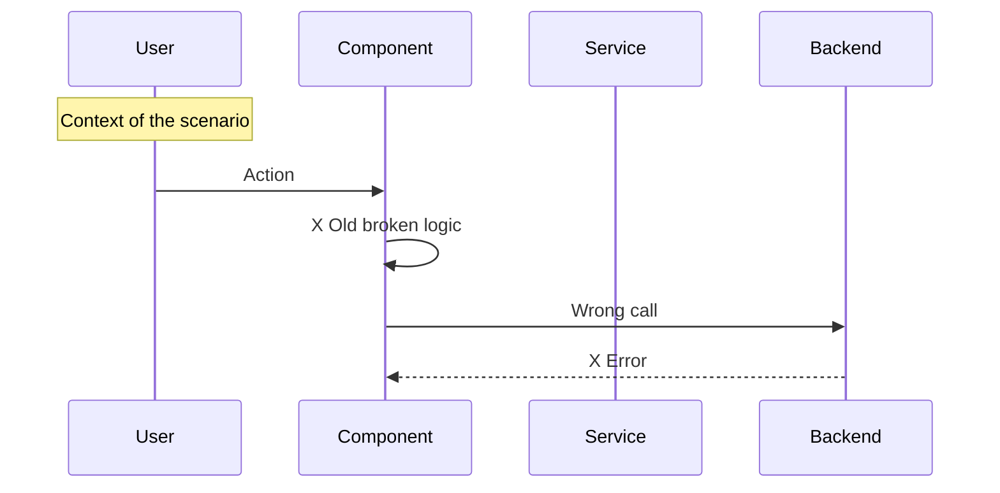
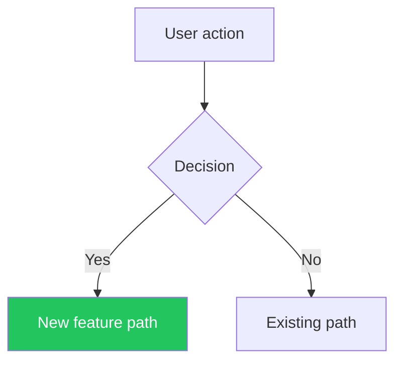
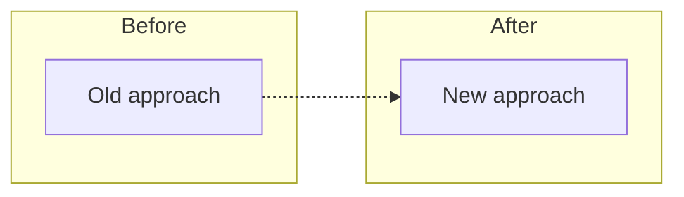
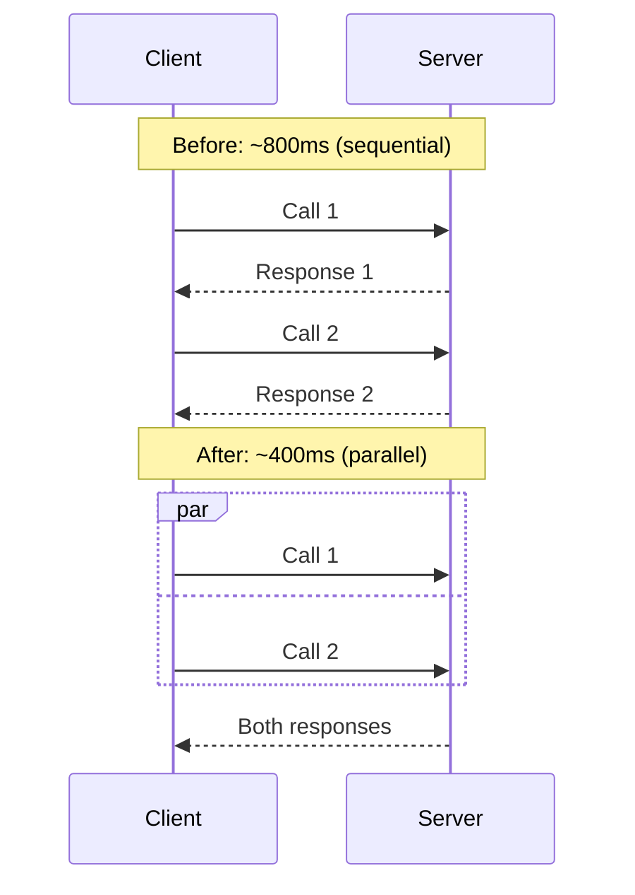
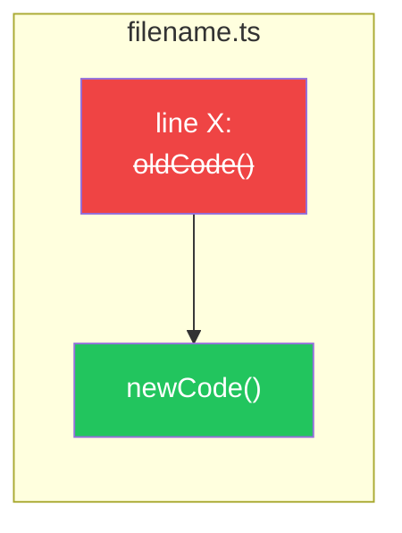

# Diagram Guidelines

Diagram content lives here so SKILL.md stays lean. Consult this file only when a diagram is applicable to the PR (architectural or system changes).

## For Bug Fixes -> Sequence Diagram (Before/After)

Show the broken flow AND the fixed flow side by side:

Then a second diagram showing the fix with checkmark markers.

## For Features -> Flowchart or Sequence Diagram

Show the new data flow or user journey:

## For Refactoring -> Flowchart with Before/After subgraphs

## For Performance -> Sequence Diagram with timing

## For Code Changes -> Flowchart with strikethrough

Show the key code changes visually:

## Color Conventions for Diagrams

Use consistent colors across all diagrams:

- `#22c55e` (green) -> Correct/Fixed/New/Success
- `#ef4444` (red) -> Broken/Removed/Error
- `#f59e0b` (amber) -> Warning/Fallback/Changed
- `#3b82f6` (blue) -> Info/Alternative path
- `#6366f1` (indigo) -> Default/Neutral state

## Mermaid Syntax — GitHub Compatibility

GitHub's Mermaid renderer is strict. Follow these rules to avoid parse errors:

1. **Subgraph IDs must not start with or be bare numbers.** Use `subgraph MyId["Label 012"]` instead of `subgraph Label 012`
2. **Node IDs must be alphanumeric identifiers** (no spaces, no leading digits). Put display text in `["..."]`
3. **Avoid special characters in bare labels**: parentheses, colons, pipes, ampersands, and quotes must be inside `["..."]`
4. **Link labels** use `-->|"label text"| B` — quote the label if it contains spaces or special chars
5. **Keep diagrams simple**: max ~15 nodes per diagram. Split into multiple diagrams if needed
6. **Always test mentally**: if an ID or label contains numbers, spaces, or symbols, wrap it in `["..."]`

### Common mistakes → fixes

| Broken | Fixed |
|--------|-------|
| `subgraph Migration 012` | `subgraph Mig012["Migration 012"]` |
| `A -->\|schema\| Migration 012` | `A -.->\|schema\| Mig012` |
| `Node (optional)` | `Node["Node (optional)"]` |
| `DB: PostgreSQL` | `DB["DB: PostgreSQL"]` |
